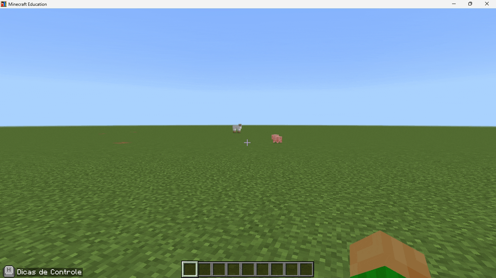

# Guia do Minecraft Education — Criação de Mundo e Conexão em Rede

Este guia foi criado para a equipe de TI da escola, com o objetivo de explicar de forma prática como o **Minecraft Education** funciona: desde a criação de um mundo até a abertura desse mundo em rede local (LAN) para que os alunos possam se conectar e jogar juntos, no modo criativo, durante as aulas.

Cada seção abaixo é ilustrada com um GIF demonstrativo. Se você já conhece o funcionamento básico do Minecraft Education, pode pular direto para a seção final, onde está disponível um **mundo plano já pré-configurado**, pronto para ser importado e usado em aula.

---

## Sumário

1. [Criando um mundo plano](#1-criando-um-mundo-plano)
2. [Opções avançadas de criação de mundo](#2-opções-avançadas-de-criação-de-mundo)
3. [Mais opções de criação de mundo](#3-mais-opções-de-criação-de-mundo)
4. [Armazenamento do mundo em nuvem (OneDrive)](#4-armazenamento-do-mundo-em-nuvem-onedrive)
5. [Opções do modo multijogador](#5-opções-do-modo-multijogador)
6. [Cheats na criação do mundo](#6-cheats-na-criação-do-mundo)
7. [Pacotes de recursos e finalização da criação](#7-pacotes-de-recursos-e-finalização-da-criação)
8. [Abrindo o inventário e colocando blocos](#8-abrindo-o-inventário-e-colocando-blocos)
9. [Dicas de controle e como voar](#9-dicas-de-controle-e-como-voar)

---

## Pule as etapas anteriores, se quiser apenas abrir o mundo para outros conectarem e baixar o mundo pré-configurado

10. [Abrindo o mundo para LAN (outros alunos conectarem)](#10-abrindo-o-mundo-para-lan-outros-alunos-conectarem)
11. [Conectando no mundo (como aluno)](#11-conectando-no-mundo-como-aluno)
12. [Mundo pré-configurado para download](#mundo-pré-configurado-para-download)

---

## 1. Criando um mundo plano

Ao abrir o Minecraft Education, a tela inicial apresenta os botões **Jogar** e **Opções**. Para começar um mundo novo, clique em **Jogar** e, em seguida, em **Criar**.

Na tela **Criar Novo Mundo**, na aba **Avançado**, é possível transformar o mundo padrão em um **mundo plano**:

- Ative a opção **Mundo clássico**, usada para construir ou minerar.
- Em **Predefinição do mundo clássico**, selecione **Mundo Superior**.
- Em **Camadas**, defina as camadas de blocos que vão compor o terreno — por exemplo:
  - Bloco de Grama — altura 1
  - Terra — altura 3
  - Pedra — altura 59
  - Rocha Matriz — altura 1

Esse é o ponto de partida ideal para aulas de construção, já que gera um terreno totalmente plano, sem relevo, árvores ou estruturas naturais atrapalhando os alunos.

---

## 2. Opções avançadas de criação de mundo

Ainda na tela de criação de mundo, a aba **Sala de Aula** reúne as configurações que mais impactam o comportamento do jogo durante a aula:

| Opção | O que faz |
|---|---|
| Comandos do console | Permite usar comandos no chat para ativar recursos específicos |
| Criador de Código | Libera os recursos de programação (blocos de código) dentro do mundo |
| Clima perfeito | Desativa o ciclo de clima, mantendo o tempo sempre claro |
| Criaturas restritas | Impede o surgimento de criaturas, seja natural ou por comando/ovo de invocação |
| Itens destrutivos | Quando desativado, bloqueia o uso de TNT, poções nocivas, explosão de bloco de renascimento e fogo se espalhando |
| Dano do jogador | Quando desativado, os jogadores não sofrem dano de nenhuma fonte |
| Dano de jogador x jogador (fogo amigo) | Permite que os jogadores causem dano uns aos outros |
| Mundo imutável | Os alunos podem interagir com blocos existentes, mas não podem destruir, minerar ou colocar novos blocos |

Para aulas de construção, é comum **desativar criaturas** e **itens destrutivos**, mantendo o foco dos alunos na criação, sem riscos de explosões ou ataques.

---

## 3. Mais opções de criação de mundo

Complementando a aba **Sala de Aula**, há também a opção **Mostrar efeitos de bloco de fronteira**, que faz os blocos de fronteira emitirem pequenas partículas vermelhas — útil para sinalizar aos alunos os limites da área de construção.

Mais abaixo, em **Configurações do link de recurso**, é possível cadastrar uma **URL** e um **nome de botão**. Ao preencher esses campos, um novo botão aparece no menu de jogo *(dentro do mundo)*, permitindo abrir um site, ferramenta de avaliação ou qualquer outro recurso vinculado à aula diretamente de dentro do Minecraft.

---

## 4. Armazenamento do mundo em nuvem (OneDrive)

Na aba **Armazenamento da Nuvem**, é possível ativar a opção **Faça Backup no OneDrive**. Com isso, o mundo criado passa a ser salvo automaticamente na conta do OneDrive vinculada ao Minecraft Education, evitando perda de progresso caso o computador local apresente problemas.

Essa configuração é especialmente recomendada quando o mesmo mundo será reaproveitado em várias aulas ou turmas.

---

## 5. Opções do modo multijogador

A aba **Multijogador** define como os alunos vão interagir entre si dentro do mesmo mundo:

- **Permissões de jogador padrão**: define o nível de permissão de quem entra no mundo.
  - **Visitante** — apenas observa, não interage.
  - **Membro** — pode construir, minerar, atacar jogadores/criaturas e interagir com itens e entidades (opção recomendada para aulas).
  - **Operador** — controle total sobre o mundo, incluindo comandos administrativos (recomendado apenas para o professor/host).
- **Fogo amigo**: define se os jogadores podem causar dano uns nos outros.
- **Indicadores do jogador**: define se os alunos aparecem como indicadores na barra localizadora, ajudando a encontrar os colegas dentro do mundo.

---

## 6. Cheats na criação do mundo

A aba **Cheats** permite habilitar comandos de trapaça (como voo livre, modo de jogo, teletransporte, dar itens, etc.) diretamente no mundo. Isso é útil para o professor ter controle total durante a aula — por exemplo, teletransportar um aluno até a área de construção ou alternar rapidamente entre modo criativo e sobrevivência.

> ⚠️ Cheats concedem acesso a comandos poderosos. Recomenda-se manter essa permissão restrita ao professor (permissão **Operador**), evitando que alunos com permissão de Membro usem comandos de forma indevida.

---

## 7. Pacotes de recursos e finalização da criação

Por fim, na aba **Pacotes de recursos** (e **Pacotes de comportamento**), é possível adicionar texturas, modelos ou comportamentos customizados ao mundo, caso a aula exija uma ambientação específica.

Depois de revisar todas as configurações, basta clicar em **Criar**, no menu lateral esquerdo, para gerar o mundo com as opções escolhidas.

---

## 8. Abrindo o inventário e colocando blocos

Pressione a tecla **E** para abrir o inventário. No modo `criativo` o jogador consegue pegar qualquer bloco para construir (incluindo blocos da tabela periódica, e outros blocos que só existem para a versão Education do jogo).
Utilizando o **botão direito do mouse** é possível colocar blocos, e com o **botão esquerdo do mouse** é possível quebrar blocos.

---

## 9. Dicas de controle e como voar

Apertando a tecla **H** podemos ver um guia com dicas de teclas, para caso algum aluno esqueça.
Apertando 2 vezes a tecla **espaço**, o jogador começa a voar, e apertando novamente ele para.
Caso o jogador já esteja voando, ele pode utilizar a tecla **shift** para descer seu personagem.

---

## 10. Abrindo o mundo para LAN (outros alunos conectarem)

Para abrir um mundo para outros jogadores se conectarem, o host (equipe de TI, ou professor) deverá apertar `ESC` para acessar o menu de configurações, clicar no ícone de vários rostinhos, e depois clicar em **COMEÇAR A SER ANFITRIÃO**, e em "confirmar".
Após isso, o jogo criará um código para entrar neste mundo (que os alunos deverão colocar em suas máquinas) utilizando ícones do Minecraft.

---

## 11. Conectando no mundo (como aluno)

Para conectar no mundo criado pelo professor (ou equipe de TI), o aluno deverá clicar em **`Jogar -> Entrar no mundo`**. Após isso ele deverá inserir o código(de ícones) gerado na etapa anterior, e depois clicar em "confirmar" para entrar no mundo.

---

## Mundo pré-configurado para download

Para quem já está familiarizado com o funcionamento do Minecraft Education e só precisa de um mundo pronto para uso em aula, disponibilizamos abaixo um **mundo plano já configurado** no modo **criativo**, ideal para atividades de construção.

**Como importar o mundo baixado no Minecraft Education:**

1. Baixe o arquivo `.mcworld` disponibilizado acima.
2. Abra o Minecraft Education.
3. Clique em `Jogar -> Importar`.
4. Clique em **Meus mundos** e selecione o mundo importado na lista para jogar.

---

### Outros mundos pré-configurados disponíveis para download (Opcional)

Lista de mundos pré-configurados para download ⬇️

---

### Checklist rápido para a equipe de TI

- [ ] Confirmar que todos os computadores estão na mesma rede local antes de tentar o modo LAN.
- [ ] Definir a permissão padrão dos alunos como **Membro** (não Operador), exceto para o professor.
- [ ] Desativar criaturas e itens destrutivos em aulas de construção.
- [ ] Ativar backup em nuvem (OneDrive) para mundos que serão reutilizados.
- [ ] Testar a importação do mundo pré-configurado antes da aula.
