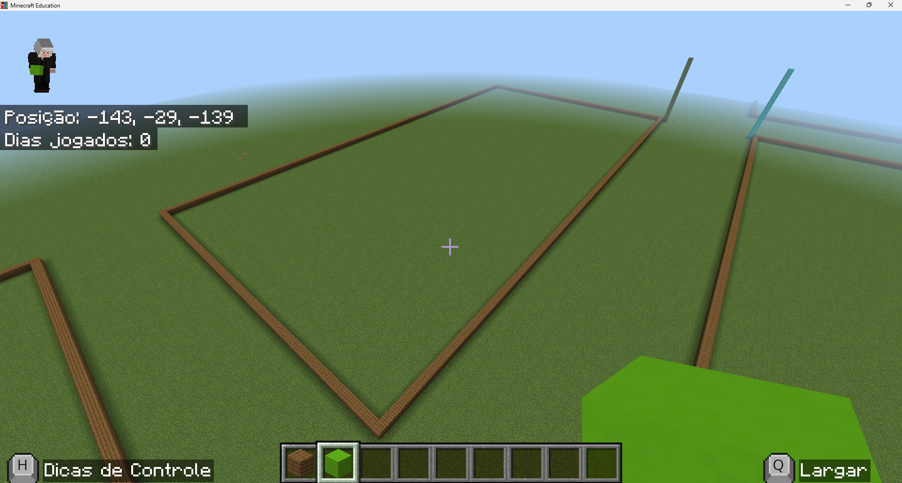
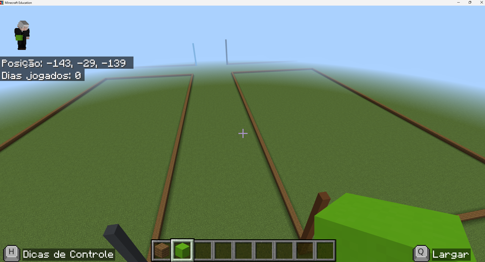
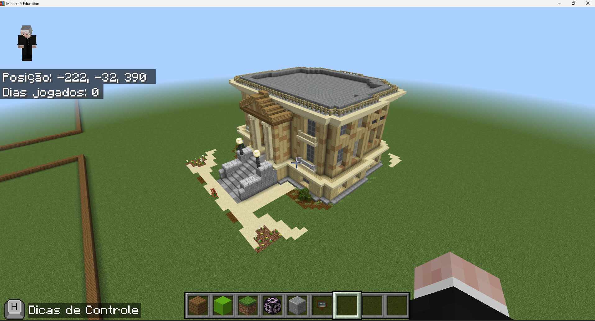
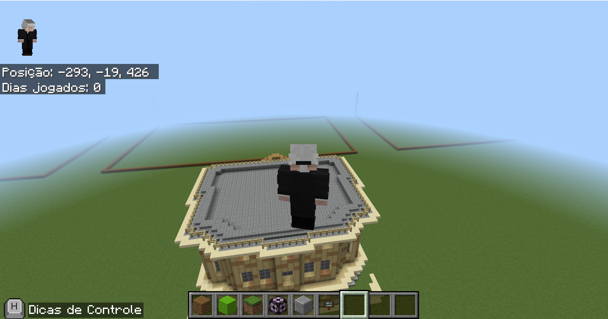
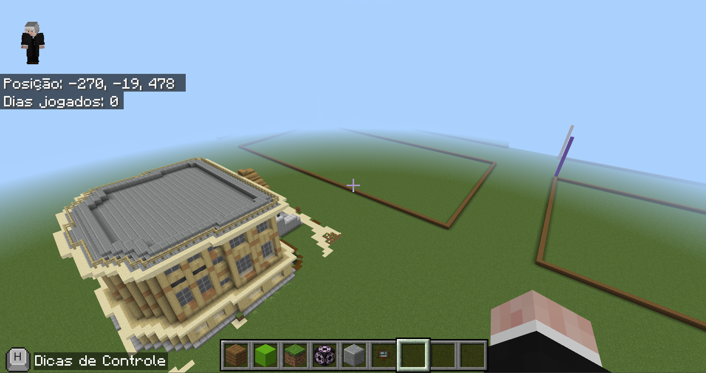

# Lista de Mundos Pré-configurados

Esta página reúne os mundos prontos para uso em aula. Para adicionar um novo mundo à lista, suba o arquivo `.mcworld` nesta mesma pasta e siga o modelo abaixo, copiando o bloco e preenchendo com as informações do novo mundo.

---

## Mundo da Escola

Breve descrição do mundo: para que serve, tipo de terreno, e se tem alguma configuração especial (cheats, multijogador, etc).

---

<!-- 
Modelo para adicionar um novo mundo — copie o bloco abaixo, preencha e cole acima desta linha:

## Nome do Mundo

Breve descrição do mundo.

---
-->
